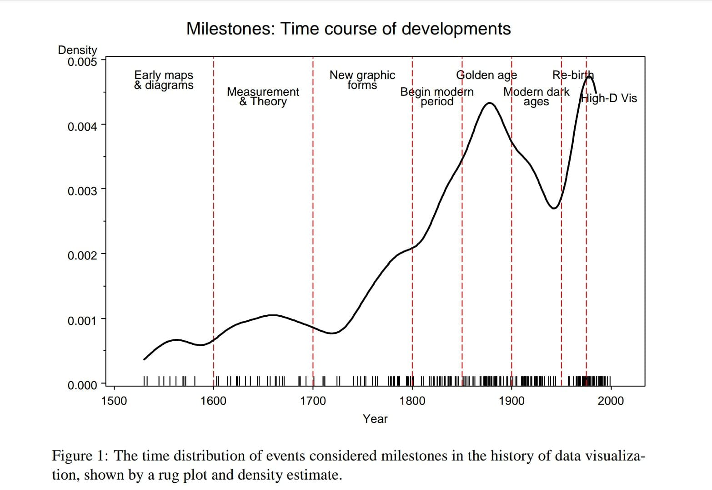

**TECNOLÓGICO NACIONAL DE MÉXICO**

**INSTITUTO TECNOLÓGICO DE TIJUANA**

**SUBDIRECCIÓN ACADÉMICA**
**PARTAMENTO DE SISTEMAS Y COMPUTACIÓN**

**CARRERA**

Ingeniería en Sistemas Computacionales

**MATERIA** 

Mineria de datos

**TÍTULO**\
Origen y gramática de las gráficas

**UNIDAD**

II

**ALUMNO Y NO. DE CONTROL**

Reyes Armenta Gerardo Antonio 17211147
Israel Lopez Pablo 17210585

**MAESTRO**\
Christian Romero Hernandez

### What is the origin of the graphs?
Quantitative graphics have been central to the development of science, and statistical graphics date from the earliest attempts to analyze data. Many familiar forms, including bivariate plots, statistical maps, bar charts, and coordinate paper, were used in the 18th century. Statistical graphics developed through attention to four problems: spatial organization (17th and 18th centuries), discrete comparison (18th and early 19th centuries), continuous distribution (19th century), and multivariate distribution and correlation (late 19th and early 20th centuries). Today, statistical graphics appear to be reemerging as an important analytic tool, with recent innovations exploiting computer graphics and related technologies.

It is common to think of statistical graphics and data visualization as relatively modern developments in statistics. In fact, the graphic portrayal of quantitative information has deep roots.
These roots reach into the histories of the earliest map-making and visual depiction, and later
into thematic cartography, statistics and statistical graphics, with applications and innovations in many fields of medicine and science that are often intertwined with each other. They also connect with the rise of statistical thinking and widespread data collection for planning and commerce up through the 19th century.

In organizing this history, it proved useful to divide history into epochs, each of which
turned out to be describable by coherent themes and labels. This division is, of course some what artificial, but it provides the opportunity to characterize the accomplishments in each period in a general way, before describing some of them in more detail. Figure 1, discussed in Section 3.2, provides a graphic overview of the epochs I describe in the subsections below, showing the frequency of events considered milestones in the periods of this history. For now, it suffices to note the labels attached to these epochs, a steady rise from the early 18th century to the late 19th century, with a curious wiggle thereafter.

### What is the grammar of graphs?

The composition of a graphic paragraph from the sentences that compose uses composition schemes other than the metric axis that is what characterizes what we have called "graphic" 5. Thus, that relationship subordination is being indicated by a drawing that mixes the schematics more than "containment" (since the bar graphs are contained in a box), “grouping by proximity” (when placing boxes near the portions of the cake with which they are related) and “link” (by the arrow of the balloon that associates the elements).

The fundamental bases of the analogy have been seated among the graphic and lexicon languages. First of all it is associated "" PARTAGE ", with" infographics ", and" graphic ", as defined in the previous chapter, with" prayer ". The graphic prayers have been seen that can be simple or composed on one side, and independent or subordinated by another. The "subject" has been introduced as the magnitude represented in a simple sentence (if several magnitudes are repressed. The prayer will be composed).

References: https://www.tandfonline.com/doi/abs/10.1080/00031305.1978.10479235#:~:text=Quantitative%20graphics%20have%20been%20central,used%20in%20the%2018th%20century. 
https://www.researchgate.net/publication/226400313_A_Brief_History_of_Data_Visualization 

https://datavis.ca/papers/hbook.pdf 
http://academica-e.unavarra.es/bitstream/handle/2454/15785/Gram%C3%A1tica.pdf?sequence=1 