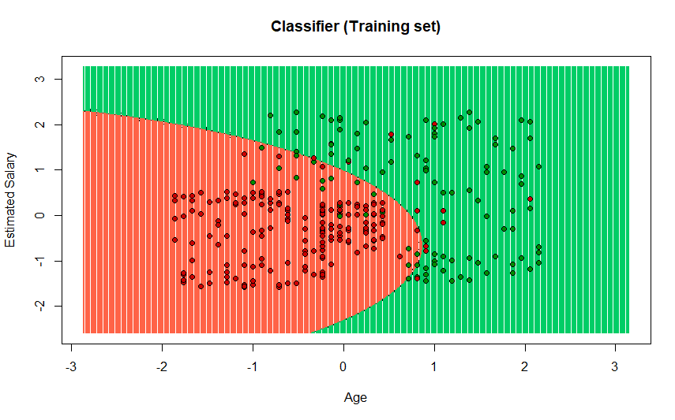
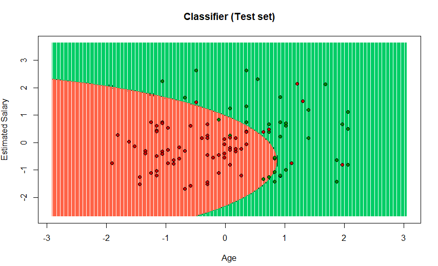
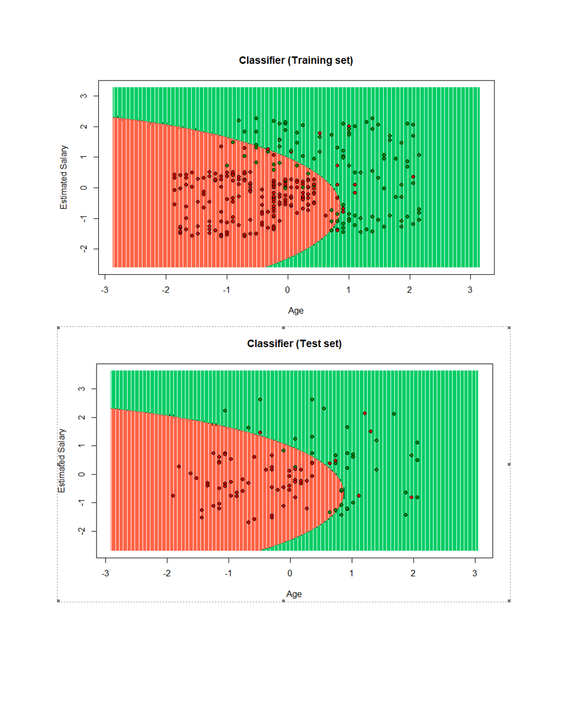

## Analysis of data visualization in the model of the Random Forest
Importing the dataset

```r
dataset = read.csv(file.choose())
dataset = dataset[3:5]
```
Splitting the dataset into the Training set and Test set
install.packages('caTools')
```r
library(caTools)
set.seed(123)
split = sample.split(dataset$Purchased, SplitRatio = 0.75)
training_set = subset(dataset, split == TRUE)
test_set = subset(dataset, split == FALSE)
```
Feature Scaling
```r
training_set[-3] = scale(training_set[-3])
test_set[-3] = scale(test_set[-3])
```
Fitting Naive Bayes to the Training set
```r
install.packages('e1071')
library(e1071)
```
Create the  model for naiveBayes this need a training_set and one option, on this case we are use Purchased
```r
classifier <- naiveBayes(formula = Purchased ~ ., data = training_set)
classifier
```
Predicting the Test set results
```r
y_pred = predict(classifier, newdata = test_set[-3])
y_pred
```
Making the Confusion Matrix
```r
cm = table(test_set[, 3], y_pred)
cm
```

pairs
```r
pairs(dataset)
  ```
# Visualising the Training set results

The library is loaded
```r
library(ElemStatLearn)
```
The training dataset was assigned
```r
set = training_set
```
We generate values by creating a vector with the minimum and maximum of each column of the dataset created
```r
X1 = seq(min(set[, 1]) - 1, max(set[, 1]) + 1, by = 0.01)
X2 = seq(min(set[, 2]) - 1, max(set[, 2]) + 1, by = 0.01)
```
expand.grid () function creates a data frame from all combinations of the supplied vectors or factors.
```r
grid_set = expand.grid(X1, X2)
```
the name is added to the columns
```r
colnames(grid_set) = c('Age', 'EstimatedSalary')
```
we add the function naiveBayes 
y_grid = predict(classifier, newdata = grid_set)
the plot is assigned with the data ranges and with the legends that the plot will carry
``` r
plot(set[, -3],
     main = 'Classifier (Training set)',
     xlab = 'Age', ylab = 'Estimated Salary',
     xlim = range(X1), ylim = range(X2))
	 ```
	 a contour is created on the graph that is being created
``` r
contour(X1, X2, matrix(as.numeric(y_grid), length(X1), length(X2)), add = TRUE)
```
 in this part you are assigning the points and the colors of the points
``` r
points(grid_set, pch = '.', col = ifelse(y_grid == 1, 'springgreen3', 'tomato'))
```
in this part coloring each section by color in the graph it is shown as it is separated by the colors green and red
``` r
points(set, pch = 21, bg = ifelse(set[, 3] == 1, 'green4', 'red3'))
```



# Visualising the Test set results
The library is loaded
```r
library(ElemStatLearn)
```
The test dataset was assigned
```r
set = test_set
```
We generate values by creating a vector with the minimum and maximum of each column of the dataset created
```r
X1 = seq(min(set[, 1]) - 1, max(set[, 1]) + 1, by = 0.01)
X2 = seq(min(set[, 2]) - 1, max(set[, 2]) + 1, by = 0.01)
```
expand.grid () function creates a data frame from all combinations of the supplied vectors or factors.
```r
grid_set = expand.grid(X1, X2)
```
the name is added to the columns
```r
colnames(grid_set) = c('Age', 'EstimatedSalary')
```
we add the function naiveBayes 
y_grid = predict(classifier, newdata = grid_set)
the plot is assigned with the data ranges and with the legends that the plot will carry
``` r
plot(set[, -3],
     main = 'Classifier (Test set)',
     xlab = 'Age', ylab = 'Estimated Salary',
     xlim = range(X1), ylim = range(X2))
	 ```
	 a contour is created on the graph that is being created
``` r
contour(X1, X2, matrix(as.numeric(y_grid), length(X1), length(X2)), add = TRUE)
```
 in this part you are assigning the points and the colors of the points
``` r
points(grid_set, pch = '.', col = ifelse(y_grid == 1, 'springgreen3', 'tomato'))
```
in this part coloring each section by color in the graph it is shown as it is separated by the colors green and red
``` r
points(set, pch = 21, bg = ifelse(set[, 3] == 1, 'green4', 'red3'))
```




we can observe that in training 'the amount of red points in the green area are less than the green points in the red area.
In the test part, the opposite case is observed since in the green area there are more red points than green points in the red area.
This means that the trend in both cases are different or go in the opposite direction.


