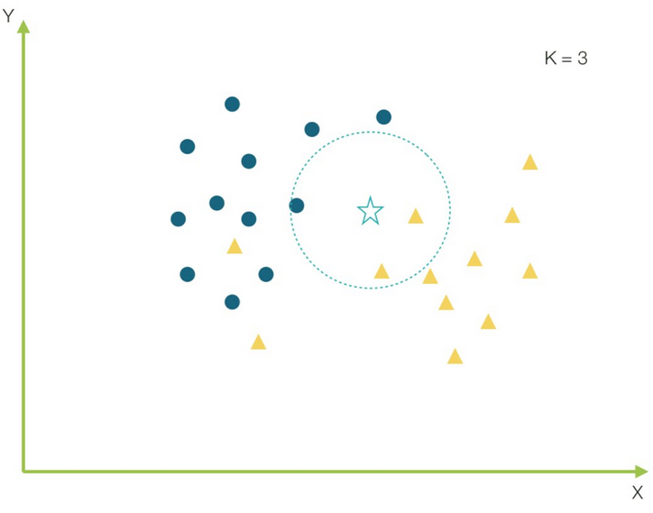

##Euclidean Distance

###What is the purpose of Euclidean distance for the K-Nearest Neighbors (K-NN) machine learning model? 

K nearest neighbors is one of the most basic and essential classification algorithms in Machine Learning. It belongs to the domain of supervised learning and finds intense application in pattern recognition, data mining and intrusion detection.

The KNN classifier is also a non-parametric, instance-based learning algorithm:

- Nonparametric means that it makes no explicit assumptions about the functional form of the data, avoiding mismodeling the underlying distribution of the data. For example, suppose our data is highly non-Gaussian, but the Machine Learning model we choose assumes a Gaussian shape. In this case, our algorithm would make extremely poor predictions.
 
- Instance-based learning means that our algorithm does not explicitly learn a model. Instead, it chooses to memorize training instances that are subsequently used as "knowledge" for the prediction phase. Concretely, this means that only when querying our database, i.e., when we ask it to predict a label with an entry, will the algorithm use the training instances to give an answer.

Suppose Z is the point that needs to be predicted. First, the point K closest to Z is found and then the points are sorted for the majority vote of their K neighbors. Each object votes for its class and the class with the most votes is taken as the prediction. To find the closest similar points, the distance between points is found using distance measures.

A popular choice is the Euclidean distance, but there are also other measures that may be more suitable for a given environment and include the Mahattan and Minkowski distance.

References:
https://aprendeia.com/k-vecinos-mas-cercanos-teoria-machine-learning/ 