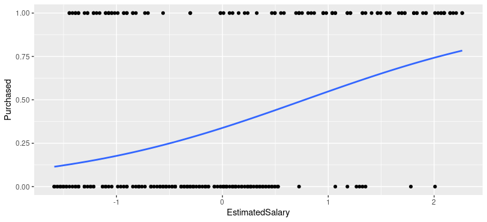
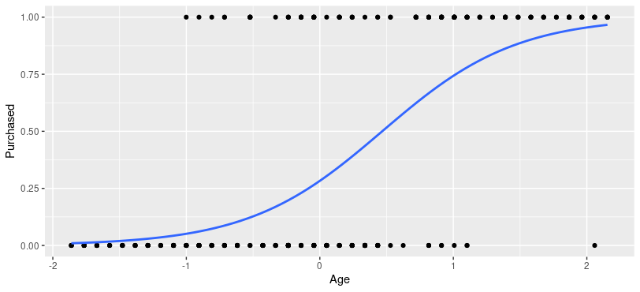

## Analysis of data visualization in the model of the Logistic Regression

We locate the corresponding address of our .r and .csv files.
Load the .csv file with our data and cut out the first two columns
``` r
getwd()
setwd("/home/gerardo/Mineria/MineriaDatos/Unit3/Practices/Pracice1")
getwd()

# Importing the dataset
dataset <- read.csv('Social_Network_Ads.csv')
dataset <- dataset[, 3:5]
```
Splitting the dataset into the Training set and Test set
``` r
# Splitting the dataset into the Training set and Test set
# Install.packages('caTools')
library(caTools)
set.seed(123)
split <- sample.split(dataset$Purchased, SplitRatio = 0.75)
training_set <- subset(dataset, split == TRUE)
test_set <- subset(dataset, split == FALSE)
```
Scale our data so that they can be correlated 
``` r
# Feature scaling
training_set[, 1:2] <- scale(training_set[, 1:2])
test_set[, 1:2] <- scale(test_set[, 1:2])
```
The logistic regression fit to the training set is created.
``` r
# Fitting Logistic Regression to Training set
classifier = glm(formula = Purchased ~ .,
                 family = binomial,
                 data = training_set)
```
The prediction of the results of the test suite is created
``` r
# Predicting the Test set results
prob_pred = predict(classifier, type = 'response', newdata = test_set[-3])
prob_pred
y_pred = ifelse(prob_pred > 0.5, 1, 0)
y_pred
```

Making the Confusion Matrix

``` r
# Making the Confusion Matrix
cm = table(test_set[, 3], y_pred)
cm
```
What interests us in the confusion matrix is the main diagonal of the matrix in this case is 57 and 26.

``` t
> cm
   y_pred
     0  1
  0 57  7
  1 10 26
  
```
We load our ggplot library to display our graphs.
We create a graph from the training set, evaluating EstimatedSalary on the x-axis and Purchased on the y-axis.

``` r
library(ggplot2)
ggplot(training_set, aes(x=EstimatedSalary, y=Purchased)) + geom_point() + 
  stat_smooth(method="glm", method.args=list(family="binomial"), se=FALSE)
```
This first graph shows an almost linear behavior because the growth of the estimated salary is proportional to purchased.



``` r
ggplot(training_set, aes(x=Age, y=Purchased)) + geom_point() + 
  stat_smooth(method="glm", method.args=list(family="binomial"), se=FALSE)
```
In this second graph we evaluate the behavior of Purchased with respect to Age. We can see that it is a constant graph because the higher the age the higher the Purchased.
