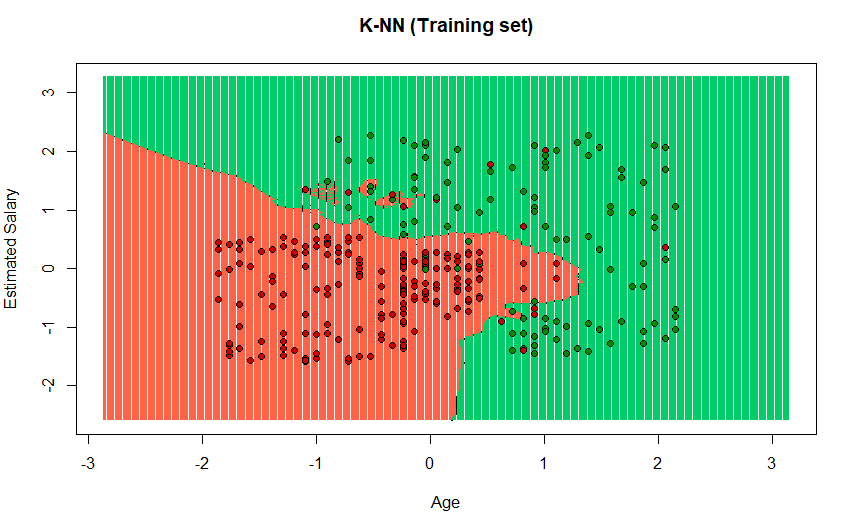
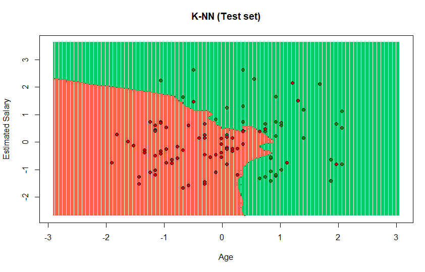
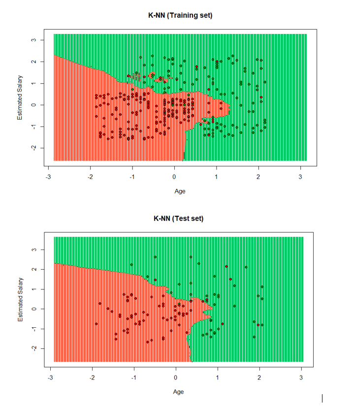

## Analysis of data visualization in the model of the knn

 K-Nearest Neighbors (K-NN)
``` r
#Importing the dataset
dataset = read.csv('Social_Network_Ads.csv')
dataset<- read.csv(file.choose())
dataset = dataset[3:5]
```
Encoding the target feature as factor
``` r
dataset$Purchased = factor(dataset$Purchased, levels = c(0, 1))
```
Splitting the dataset into the Training set and Test set
install.packages('caTools')
``` r
library(caTools)
set.seed(123)
split = sample.split(dataset$Purchased, SplitRatio = 0.75)
training_set = subset(dataset, split == TRUE)
test_set = subset(dataset, split == FALSE)
```
Feature Scaling
``` r
training_set[-3] = scale(training_set[-3])
test_set[-3] = scale(test_set[-3])
```
Fitting K-NN to the Training set and Predicting the Test set results
``` r
library(class)
 y_pred = knn(train = training_set[, -3],
             test = test_set[, -3],
             cl = training_set[, 3],
             k = 5,
             prob = TRUE)
```
Making the Confusion Matrix
``` r
cm = table(test_set[, 3], y_pred)
```
Visualizing the Training set results
The library is loaded
``` r
library (ElemStatLearn)
```
The training dataset was assigned
``` r
set = training_set
```
We generate values by creating a vector with the minimum and maximum of each column of the dataset created
``` r
X1 = seq (min (set [, 1]) - 1, max (set [, 1]) + 1, by = 0.01)
X2 = seq (min (set [, 2]) - 1, max (set [, 2]) + 1, by = 0.01)
```
expand.grid () function creates a data frame from all combinations of the supplied vectors or factors.
``` r
grid_set = expand.grid (X1, X2)
```
the name is added to the columns
``` r
colnames (grid_set) = c ('Age', 'EstimatedSalary')
```
The KNN function is executed which is taking the following parameters:
train: matrix or data frame of training set cases.
Test: matrix or data frame of test set cases. A vector will be interpreted as a row vector for a single case.
Cl: factor of true classifications of training set
K number of neighbors considered.
``` r
y_grid = knn (train = training_set [, -3], test = grid_set, cl = training_set [, 3], k = 5)
```
the plot is assigned with the data ranges and with the legends that the plot will carry
``` r
plot (set [, -3],
      main = 'K-NN (Training set)',
      xlab = 'Age', ylab = 'Estimated Salary',
      xlim = range (X1), ylim = range (X2))
```
 a contour is created on the graph that is being created
``` r
contour (X1, X2, matrix (as.numeric (y_grid), length (X1), length (X2)), add = TRUE)
```
 in this part you are assigning the points and the colors of the points
``` r
points (grid_set, pch = '.', col = ifelse (y_grid == 1, 'springgreen3', 'tomato'))
```
in this part coloring each section by color in the graph it is shown as it is separated by the colors green and red
``` r
points (set, pch = 21, bg = ifelse (set [, 3] == 1, 'green4', 'red3'))
```


 Visualising the Test set results
 The library is loaded
``` r
library(ElemStatLearn)
```
The test dataset was assigned
``` r
set = test_set
```
We generate values by creating a vector with the minimum and maximum of each column of the dataset created
``` r
X1 = seq(min(set[, 1]) - 1, max(set[, 1]) + 1, by = 0.01)
X2 = seq(min(set[, 2]) - 1, max(set[, 2]) + 1, by = 0.01)
```
expand.grid () function creates a data frame from all combinations of the supplied vectors or factors.
``` r
grid_set = expand.grid(X1, X2)
```
the name is added to the columns
``` r
colnames(grid_set) = c('Age', 'EstimatedSalary')
```
The KNN function is executed which is taking the following parameters:
train: matrix or data frame of training set cases.
Test: matrix or data frame of test set cases. A vector will be interpreted as a row vector for a single case.
Cl: factor of true classifications of training set
K number of neighbors considered.
``` r
y_grid = knn(train = test_set[, -3], test = grid_set, cl = test_set[, 3], k = 5)
```
the plot is assigned with the data ranges and with the legends that the plot will carry
``` r
plot(set[, -3],
     main = 'K-NN (Test set)',
     xlab = 'Age', ylab = 'Estimated Salary',
     xlim = range(X1), ylim = range(X2))
	 ```
a contour is created on the graph that is being created
``` r
contour(X1, X2, matrix(as.numeric(y_grid), length(X1), length(X2)), add = TRUE)
```
in this part you are assigning the points and the colors of the points
``` r
points(grid_set, pch = '.', col = ifelse(y_grid == 1, 'springgreen3', 'tomato'))
```
in this part coloring each section by color in the graph it is shown as it is separated by the colors green and red
``` r
points(set, pch = 21, bg = ifelse(set[, 3] == 1, 'green4', 'red3'))
```





when observing the two charts on the pictures, we can see a difference, because on training have more point that the test and on the test have more points reds on the seccion green and the training have mores point greend on the seccion red


