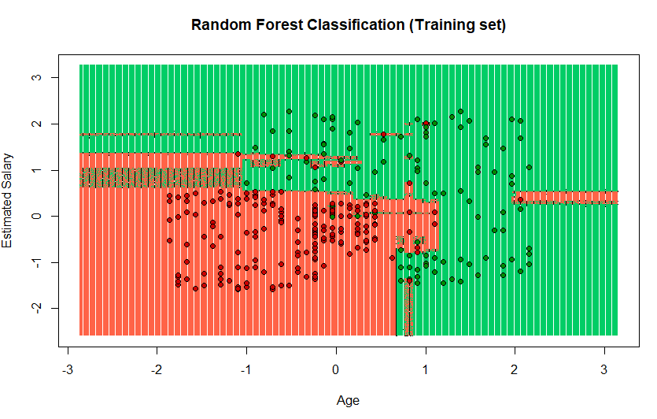
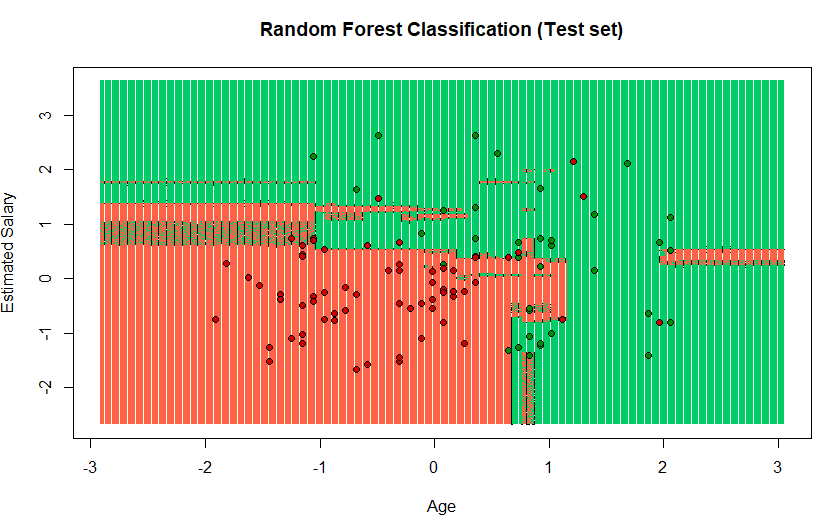
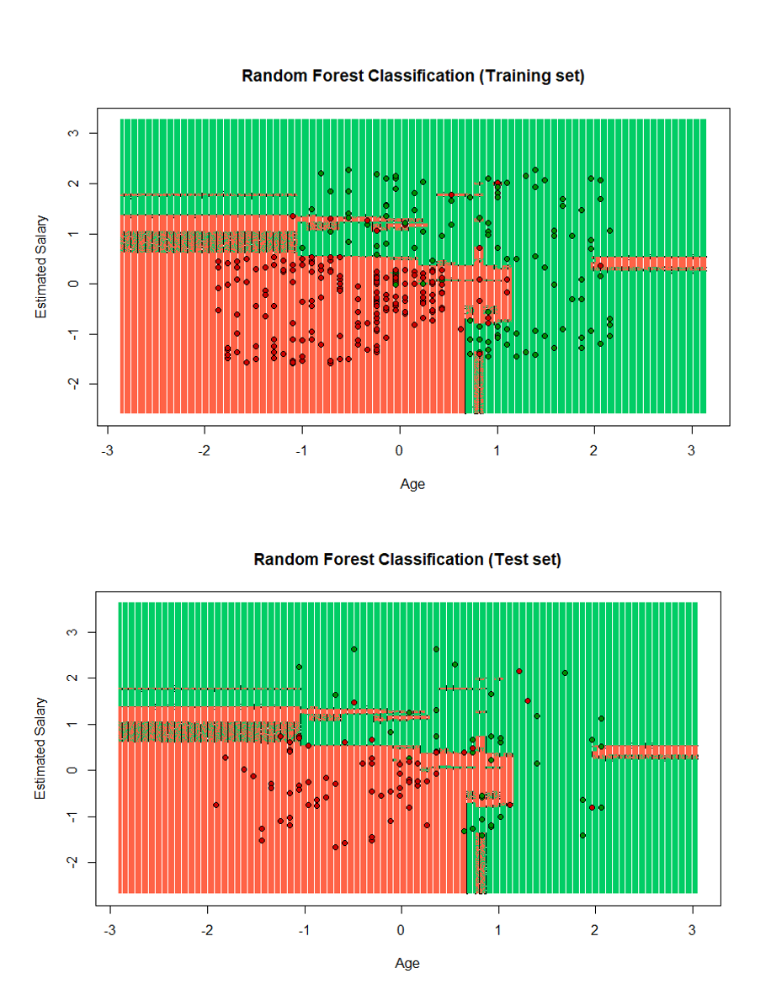

## Analysis of data visualization in the model of Random Forest

 Random Forest
``` r
#Importing the dataset
dataset = read.csv('Social_Network_Ads.csv')
dataset<- read.csv(file.choose())
dataset = dataset[3:5]
```
Encoding the target feature as factor
``` r
dataset$Purchased = factor(dataset$Purchased, levels = c(0, 1))
```
Splitting the dataset into the Training set and Test set
install.packages('caTools')
``` r
library(caTools)
set.seed(123)
split = sample.split(dataset$Purchased, SplitRatio = 0.75)
training_set = subset(dataset, split == TRUE)
test_set = subset(dataset, split == FALSE)
```
Feature Scaling
``` r
training_set[-3] = scale(training_set[-3])
test_set[-3] = scale(test_set[-3])
```
Fitting Random Forest Classification to the Training set and add numbers of ntree
``` r
library(randomForest)
set.seed(123)
classifier = randomForest(x = training_set[-3],
                          y = training_set$Purchased,
                          ntree =10)
```

Predicting the Test set results
``` r
y_pred = predict(classifier, newdata = test_set[-3])
y_pred
```
Making the Confusion Matrix
``` r
cm = table(test_set[, 3], y_pred)
```
Visualizing the Training set results
The library is loaded
``` r
library(ElemStatLearn)
```
The training dataset was assigned
``` r
set = training_set
```
We generate values by creating a vector with the minimum and maximum of each column of the dataset created
``` r
X1 = seq(min(set[, 1]) - 1, max(set[, 1]) + 1, by = 0.01)
X2 = seq(min(set[, 2]) - 1, max(set[, 2]) + 1, by = 0.01)
```
expand.grid () function creates a data frame from all combinations of the supplied vectors or factors.
``` r
grid_set = expand.grid (X1, X2)
```
the name is added to the columns
``` r
colnames (grid_set) = c ('Age', 'EstimatedSalary')
```
we assign to predict the model that is being used in this case random forest
``` r
y_grid = predict(classifier, grid_set)
```
the plot is assigned with the data ranges and with the legends that the plot will carry
``` r
plot(set[, -3],
     main = 'Random Forest Classification (Training set)',
     xlab = 'Age', ylab = 'Estimated Salary',
     xlim = range(X1), ylim = range(X2))
	 ```
a contour is created on the graph that is being created
``` r
contour(X1, X2, matrix(as.numeric(y_grid), length(X1), length(X2)), add = TRUE)
```
in this part you are assigning the points and the colors of the points
``` r
points(grid_set, pch = '.', col = ifelse(y_grid == 1, 'springgreen3', 'tomato'))
```
in this part coloring each section by color in the graph it is shown as it is separated by the colors green and red
``` r
points(set, pch = 21, bg = ifelse(set[, 3] == 1, 'green4', 'red3'))
```



 Visualising the Test set results

The library is loaded
``` r
library(ElemStatLearn)
```
The training dataset was assigned
``` r
set = training_set
```
We generate values by creating a vector with the minimum and maximum of each column of the dataset created
``` r
X1 = seq(min(set[, 1]) - 1, max(set[, 1]) + 1, by = 0.01)
X2 = seq(min(set[, 2]) - 1, max(set[, 2]) + 1, by = 0.01)
```
expand.grid () function creates a data frame from all combinations of the supplied vectors or factors.
``` r
grid_set = expand.grid (X1, X2)
```
the name is added to the columns
``` r
colnames (grid_set) = c ('Age', 'EstimatedSalary')
```
we assign to predict the model that is being used in this case random forest
``` r
y_grid = predict(classifier, grid_set)
```
the plot is assigned with the data ranges and with the legends that the plot will carry
``` r
plot(set[, -3], main = 'Random Forest Classification (Test set)',
     xlab = 'Age', ylab = 'Estimated Salary',
     xlim = range(X1), ylim = range(X2))
	 ```
a contour is created on the graph that is being created
``` r
contour(X1, X2, matrix(as.numeric(y_grid), length(X1), length(X2)), add = TRUE)
```
in this part you are assigning the points and the colors of the points
``` r
points(grid_set, pch = '.', col = ifelse(y_grid == 1, 'springgreen3', 'tomato'))
```
in this part coloring each section by color in the graph it is shown as it is separated by the colors green and red
``` r
points(set, pch = 21, bg = ifelse(set[, 3] == 1, 'green4', 'red3'))
```



As we can see in the images you can see the separation of the points in this case for the test there are more red points in the green part than the green ones in the red part.


