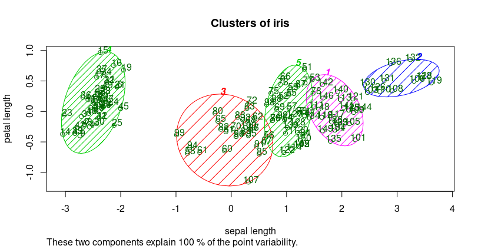
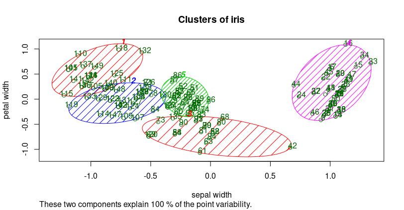

# K-Means Clustering

Importing the dataset
```r
dataset = read.csv(file.choose())
grupo1 = dataset[1:2]
grupo2=dataset[1:1]
grupo2<- cbind(grupo2,dataset[3:3])   
grupo3=dataset[1:1]
grupo3<- cbind(grupo3,dataset[4:4])   
grupo4 = dataset[2:3]
grupo5=dataset[2:2]
grupo5<- cbind(grupo5,dataset[4:4])   
grupo6 = dataset[3:4]
```
     
### Group 1
Using the elbow method to find the optimal number of clusters
```r
set.seed(6)
wcss = vector()
for (i in 1:10) wcss[i] = sum(kmeans(grupo1, i)$withinss)
plot(1:10,
     wcss,
     type = 'b',
     main = paste('The Elbow Method'),
     xlab = 'Number of clusters',
     ylab = 'WCSS')
```

Fitting K-Means to the dataset
```r
set.seed(29)
kmeans = kmeans(x = grupo1, centers = 5)
y_kmeans = kmeans$cluster
```
Visualising the clusters
install.packages('cluster')
```r
library(cluster)
clusplot(grupo1,
         y_kmeans,
         lines = 0,
         shade = TRUE,
         color = TRUE,
         labels = 2,
         plotchar = FALSE,
         span = TRUE,
         main = paste('Clusters of iris'),
         xlab = 'sepal length',
         ylab = 'sepal width')

```


---

### Group 2
Using the elbow method to find the optimal number of clusters
``` r
set.seed(6)
wcss = vector()
for (i in 1:10) wcss[i] = sum(kmeans(grupo2, i)$withinss)
plot(1:10,
     wcss,
     type = 'b',
     main = paste('The Elbow Method'),
     xlab = 'Number of clusters',
     ylab = 'WCSS')
```

Fitting K-Means to the dataset
```r
set.seed(29)
kmeans = kmeans(x = grupo2, centers = 5)
y_kmeans = kmeans$cluster
```
Visualising the clusters
```r
clusplot(grupo2,
         y_kmeans,
         lines = 0,
         shade = TRUE,
         color = TRUE,
         labels = 2,
         plotchar = FALSE,
         span = TRUE,
         main = paste('Clusters of iris'),
         xlab = 'sepal length',
         ylab = 'petal length')
```


---

### Group 3
Using the elbow method to find the optimal number of clusters
```r
set.seed(6)
wcss = vector()
for (i in 1:10) wcss[i] = sum(kmeans(grupo3, i)$withinss)
plot(1:10,
     wcss,
     type = 'b',
     main = paste('The Elbow Method'),
     xlab = 'Number of clusters',
     ylab = 'WCSS')
```

Fitting K-Means to the dataset
```r
set.seed(29)
kmeans = kmeans(x = grupo3, centers = 5)
y_kmeans = kmeans$cluster
```
 Visualising the clusters
```r
clusplot(grupo3,
         y_kmeans,
         lines = 0,
         shade = TRUE,
         color = TRUE,
         labels = 2,
         plotchar = FALSE,
         span = TRUE,
         main = paste('Clusters of iris'),
         xlab = 'sepal length',
         ylab = 'petal width')
```


---

### Group 4
Using the elbow method to find the optimal number of clusters
```r
set.seed(6)
wcss = vector()
for (i in 1:10) wcss[i] = sum(kmeans(grupo4, i)$withinss)
plot(1:10,
     wcss,
     type = 'b',
     main = paste('The Elbow Method'),
     xlab = 'Number of clusters',
     ylab = 'WCSS')
```

Fitting K-Means to the dataset
``` r
set.seed(29)
kmeans = kmeans(x = grupo4, centers = 5)
y_kmeans = kmeans$cluster
```
Visualising the clusters
``` r
clusplot(grupo4,
         y_kmeans,
         lines = 0,
         shade = TRUE,
         color = TRUE,
         labels = 2,
         plotchar = FALSE,
         span = TRUE,
         main = paste('Clusters of customers'),
         xlab = 'sepal width',
         ylab = 'petal length')
```


---

### Group 5
Using the elbow method to find the optimal number of clusters
``` r
set.seed(6)
wcss = vector()
for (i in 1:10) wcss[i] = sum(kmeans(grupo5, i)$withinss)
plot(1:10,
     wcss,
     type = 'b',
     main = paste('The Elbow Method'),
     xlab = 'Number of clusters',
     ylab = 'WCSS')
```

Fitting K-Means to the dataset
``` r
set.seed(29)
kmeans = kmeans(x = grupo5, centers = 5)
y_kmeans = kmeans$cluster
```
Visualising the clusters
``` r
clusplot(grupo5,
         y_kmeans,
         lines = 0,
         shade = TRUE,
         color = TRUE,
         labels = 2,
         plotchar = FALSE,
         span = TRUE,
         main = paste('Clusters of iris'),
         xlab = 'sepal width',
         ylab = 'petal width')
```


---

### Group 6
Using the elbow method to find the optimal number of clusters
```r 
set.seed(6)
wcss = vector()
for (i in 1:10) wcss[i] = sum(kmeans(grupo6, i)$withinss)
plot(1:10,
     wcss,
     type = 'b',
     main = paste('The Elbow Method'),
     xlab = 'Number of clusters',
     ylab = 'WCSS')
```

Fitting K-Means to the dataset
``` r
set.seed(29)
kmeans = kmeans(x = grupo6, centers = 5)
y_kmeans = kmeans$cluster
```
Visualising the clusters
``` r
clusplot(grupo6,
         y_kmeans,
         lines = 0,
         shade = TRUE,
         color = TRUE,
         labels = 2,
         plotchar = FALSE,
         span = TRUE,
         main = paste('Clusters of customers'),
         xlab = 'petal length',
         ylab =  'petal width')
```


